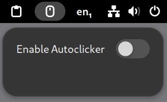

# Clickmate Autoclicker

Clickmate is an autoclicker daemon that can be controlled via HTTP requests. It allows you to programmatically start and stop mouse click events on your system. The daemon runs as a background service and communicates with a GNOME Shell extension to provide a user-friendly interface for toggling the autoclicker.



## Features
- **HTTP API**: Control the autoclicker status (on/off) via HTTP requests.
- **GNOME Shell Extension**: Provides a panel button in the GNOME Shell to toggle the autoclicker on and off.
- **Daemon Service**: Runs as a background service, managed by systemd for easy installation and uninstallation.

## Requirements
- **Linux System**: The daemon uses Linux-specific APIs (`uinput`).
- **GCC Compiler**: Required to compile the C code.
- **libjson-c**: JSON parsing library.
- **libmicrohttpd**: Micro HTTP Daemon library for handling HTTP requests.
- **GNOME Shell**: For running the GNOME Shell extension.

## Installation

### Compile and Install Daemon
1. Clone the repository:
   ```bash
   git clone https://github.com/your-repo/clickmate.git
   cd clickmate
   ```

2. Build the daemon:
   ```bash
   make
   ```

3. Install the daemon and service file:
   ```bash
   sudo make install
   ```

### Enable GNOME Shell Extension
1. cd gnome-shell
2. pnpm install
3. pnpm run build
4. pnpm run install
5. Gnome Shell Logout/Login
6. Enable clickmate in the extensions manager

## Usage

### Control via HTTP API
You can control the autoclicker status by sending HTTP requests to the daemon's Unix socket (`/var/run/click-socket`).

#### Start Autoclicker
```bash
curl --unix-socket /var/run/click-socket -X POST -H "Content-Type: application/json" -d '{"status":"on"}'
```

#### Stop Autoclicker
```bash
curl --unix-socket /var/run/click-socket -X POST -H "Content-Type: application/json" -d '{"status":"off"}'
```

#### Check Status
```bash
curl --unix-socket /var/run/click-socket -X GET
```

### Control via GNOME Shell Extension
1. Click on the mouse icon in the GNOME panel.
2. Toggle the switch to start or stop the autoclicker.

## Uninstallation

### Remove Daemon and Service File
```bash
sudo make uninstall
```

## Troubleshooting
- **Daemon Not Starting**: Ensure you have the necessary permissions to access `/dev/uinput` and that `libjson-c` and `libmicrohttpd` are installed.
- **Extension Not Working**: Make sure the GNOME Shell extension is enabled and that the daemon is running.

## Contributing
Contributions are welcome! Please fork the repository, make your changes, and submit a pull request.
