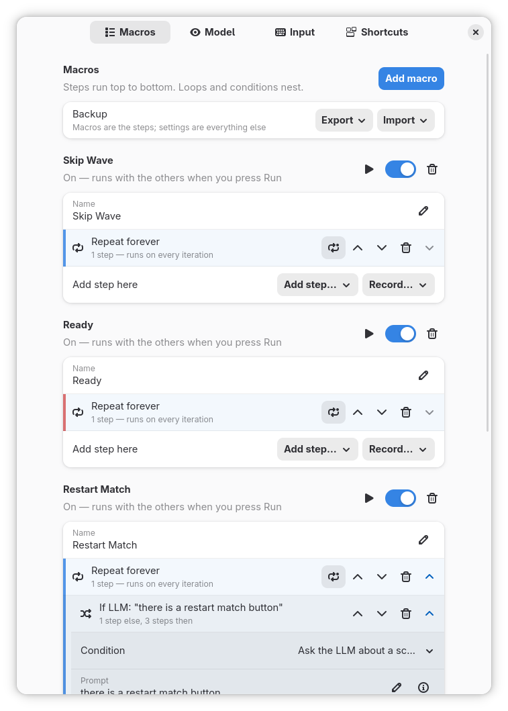

# Clickmate

Record, edit and replay input macros on GNOME/Wayland — with loops, and with
conditions that can look at the screen.



A macro is a tree of steps: clicks, key presses, typed text, scrolls, waits and
recorded event trains. Around them you can put `repeat`, `while` and `if`
blocks, and the latter two are driven by a condition:

- **screen colour** — "the pixel at 840,512 is green ±24", or "60% of this
  40×40 area is green". Sub-5 ms, deterministic, no network.
- **ask a local vision model** — a screenshot plus your own prompt ("Is the button
  on the left green?"), answered yes/no by an OpenAI-compatible endpoint running
  on your machine.
- **and / or / not** over the above.

The macro that ships on first run is the one this was built for:

```
repeat forever:
    if the model says the left button is green:
        click at x,y
        if a colour check passes:
            press E
    wait 10s
```

## Features

- **Recording** of real mouse and keyboard input, coalesced into readable steps:
  clicks carry their absolute screen position, pointer movement becomes a move
  step wherever it comes to rest, and idle gaps become waits. Or verbatim event
  trains, for games.
- **A full tree editor in preferences** — every step and condition, nested
  loops and `and`/`or`/`not`, plain-language summaries, enable/disable so you can
  bisect a macro instead of deleting from it, and JSON import/export.
- **A panel popup that stays out of the way** — one switch, what is running, and a
  way into the settings.
- **Emergency stop** that aborts mid-macro and releases every held key.

## How it fits together

| Piece | Role |
|---|---|
| `clickmate.c` | Root daemon. Grabs the real input devices, mirrors them to uinput clones, injects event trains on request, and streams observed events while recording. Always forwards real input. **No macro logic.** |
| `gnome-shell/` | The extension. Owns the macro model, the editor UI, all control flow, screenshots and the model calls. |

The split is deliberate: the daemon is the only thing that can see and synthesise
input below the compositor, and the shell is the only thing that knows where the
pointer actually is and can screenshot without a portal prompt. Because the
extension sends one step at a time, stopping a macro is immediate.

### Absolute positioning

uinput only speaks *relative* motion. To click at a fixed coordinate the extension
nudges the pointer, re-reads `global.get_pointer()` and repeats until it lands, so
it converges whatever the acceleration curve is doing. While a macro runs the mouse
acceleration profile is temporarily flattened (restored afterwards, and also on the
next login if the shell died mid-run), which makes it land on the first try.

If the target application grabs the pointer — games with mouse look — absolute
moves cannot converge. Record those with **Record verbatim** enabled; they replay
as raw relative event trains instead.

## Requirements

- Linux with `uinput`, GCC, `libjson-c`, `libmicrohttpd`
- GNOME Shell 50 on Wayland
- optional: any OpenAI-compatible vision endpoint, for the `llm` condition

## Installation

### Daemon

```bash
make
sudo make install
```

`clickmate.service` names the devices to capture. List yours with:

```bash
grep '^N: Name' /proc/bus/input/devices
```

and edit the `-n` lines to match. Names rather than paths, because anything
paired through a wireless receiver gets no entry under `/dev/input/by-id` at all,
and bare `/dev/input/eventN` numbers move around between boots. `-d PATH` still
works if you prefer it. A name that matches nothing is only a warning, so an
unplugged device does not stop the rest from being captured.

**Capture every device you intend to record from.** A keyboard-with-touchpad and
a separate mouse are two devices; if the mouse is not listed, the daemon never
sees it and nothing it does is recorded or observed.

The daemon takes an exclusive grab on those devices. The kernel drops a grab when
the process dies, so a crash self-heals — but while changing the C code, run it
from an **SSH session or a second TTY** and wrap it in `timeout 60`, so a mistake
cannot lock you out of your own keyboard.

### Extension

```bash
cd gnome-shell
pnpm install
pnpm run build
pnpm run install     # symlinks dist/ into ~/.local/share/gnome-shell/extensions
```

Log out and back in (Wayland has no `Alt+F2 r`), then enable *Clickmate*.

### A local vision model

Only needed for `llm` conditions. For example:

```bash
ollama serve
ollama pull qwen2.5vl:7b
```

then point *Preferences → Model → Endpoint* at
`http://localhost:11434/v1/chat/completions`. Preferences warns when the endpoint
is not on this machine, because every check uploads a picture of your screen to it.

Endpoint, model and timeout are global — conditions carry only the prompt, the
screen area, and what to do on a failure. Each condition is asked for a single
JSON object, `{"match": true|false, "reason": "…"}`, and `response_format:
json_object` is sent so servers that support constrained decoding enforce it
(the field is dropped automatically if the server rejects it). Small models
still wander, so the reply parser also accepts fenced JSON, `"true"` as a
string, `1`/`0`, alternate keys like `answer` or `result`, trailing chatter, and
a bare YES/NO. If a prompt misbehaves, the popup's status line shows what the
model actually said.

## Usage

| Shortcut | Action |
|---|---|
| `Ctrl+Shift+F5` | Open the popup |
| `Ctrl+Shift+F6` | Run / stop the selected macro |
| `Ctrl+Shift+R` | Start / stop recording into the selected macro |
| `Ctrl+Shift+M` | Capture one click or move, appended to the selected macro |
| `Super+Escape` | Emergency stop |

The panel popup holds only a master switch, the name of whatever is running, and a
**Settings** button. It is also where progress shows up: the current step, the
last condition verdict, "Recorded 3 steps". That text is kept after the fact,
because most of it happens while the menu is closed — click the panel icon to
read it. Everything else — macros, steps, conditions, which macro the switch
runs — lives in the preferences window.

While a macro is running, opening the menu and putting the pointer on it pauses
the run between steps — otherwise a macro clicking at fixed coordinates could
click its own menu. It resumes as soon as you move off the menu or close it.

Build a macro by recording it (`Ctrl+Shift+R`), then open Settings to adjust it.
Recorded steps are appended to the end of the selected macro — if that macro is
already an endless loop, you are told so, because the new steps would sit
somewhere that never runs.

Recording always resumes from wherever the macro already leaves the pointer.
Between two sessions the mouse gets used for other things, and moving it back to
that spot is not a step worth keeping, so it is not recorded. Anywhere else is,
at its true screen position — coordinates are never shifted.

Next to every **Add** button there is a **Record** button that captures a single
action, which is the quickest way to fill in coordinates: the window gets out of
the way, and the next click you make becomes a `click` step at that position. If
you move the pointer and hold still for about a second instead, you get a `move`
step. `Ctrl+Shift+M` does the same thing without opening Settings, appending to
the end of the selected macro.

Coordinates are single fields — `100, 200` for a point, `10, 20, 40, 40` for an
area — each with a **Show** button that flashes a red X (or an outline) at that
spot on the real screen for a couple of seconds, so you can check a number
without running anything. Screen areas for `llm` conditions can also be chosen
with **Pick area…**, which drops the window out of the way and lets you drag a
rectangle over the screen.

### Daemon HTTP API

Over the unix socket at `/var/run/click-socket`:

```bash
curl --unix-socket /var/run/click-socket http://localhost/status

# left click: press, then release 50 ms later
curl --unix-socket /var/run/click-socket -X POST \
  -d '{"events":[{"dt":0,"type":1,"code":272,"value":1},{"dt":50000,"type":1,"code":272,"value":0}]}' \
  http://localhost/play

curl --unix-socket /var/run/click-socket -X POST -d '{"on":true}'  http://localhost/record
curl --unix-socket /var/run/click-socket -X POST -d '{}'           http://localhost/stop
```

### Checking what is captured

`tools/watch-events` drives the daemon on its own — no shell extension involved.
It lists the captured devices, turns recording on, decodes the stream, and tells
you which devices actually produced anything:

```bash
tools/watch-events 15      # watch for 15 seconds, then summarise
tools/watch-events         # until Ctrl-C
tools/watch-events 15 --raw
```

If a device does not appear here, nothing above the daemon can see it either —
add it to `clickmate.service` with `-n "<its name>"`.

Or by hand (`socat` works too, if you have it):

```bash
curl --unix-socket /var/run/click-socket -X POST -d '{"on":true}' http://localhost/record
python3 -c "
import socket; s = socket.socket(socket.AF_UNIX, socket.SOCK_STREAM)
s.connect('/var/run/clickmate-events')
[print(s.recv(4096).decode(), end='') for _ in range(20)]"
curl --unix-socket /var/run/click-socket -X POST -d '{"on":false}' http://localhost/record
```

`dt` is microseconds to wait *before* the event; `type`/`code`/`value` are raw
evdev. `/play` answers once the train has finished playing. `/stop` aborts it and
releases anything still held down.

## Development

```bash
cd gnome-shell
pnpm run dev      # rebuild on change
pnpm test         # build, then run the logic smoke tests under gjs
journalctl -f -o cat /usr/bin/gnome-shell
```

`./run.sh` starts a nested shell, useful for UI work only: injected uinput events
go to the *host* session, so end-to-end runs must be tested in the real session.
Cross-check injected input with `sudo libinput debug-events` and `sudo evtest`.

### Known limits

- The control socket is mode 0666, so any local process can synthesise input
  through it. Fine for a single-user desktop; tighten it with a `RuntimeDirectory`
  and a dedicated group if that matters to you.
- `type text` assumes a US keyboard layout. For other layouts, record the typing.
- X11 is not supported.

## Uninstallation

```bash
sudo make uninstall
rm ~/.local/share/gnome-shell/extensions/clickmate@tbocek.github.com
```

### Resolving a boot delay

A boot delay after installing is usually `systemd-udev-settle.service`. It is
deprecated; mask it:

```bash
systemctl mask systemd-udev-settle.service
```

## Troubleshooting

- **Popup says it cannot reach the daemon** — `systemctl status clickmate`, and
  check the socket path in *Preferences → Input*.
- **"The clickmate daemon is out of date"** — the extension needs API v2; rerun
  `sudo make install`.
- **Clicks land in the wrong place** — leave *Flatten pointer acceleration* on, or
  check whether the target grabs the pointer (see *Absolute positioning*).
- **Daemon will not start** — check permissions on `/dev/uinput` and that
  `libjson-c` and `libmicrohttpd` are installed.

## Contributing

Contributions are welcome! Please fork the repository, make your changes, and
submit a pull request.

## Related links

- https://www.kernel.org/doc/html/v4.12/input/uinput.html
- https://stackoverflow.com/questions/20943322/accessing-keys-from-linux-input-device
